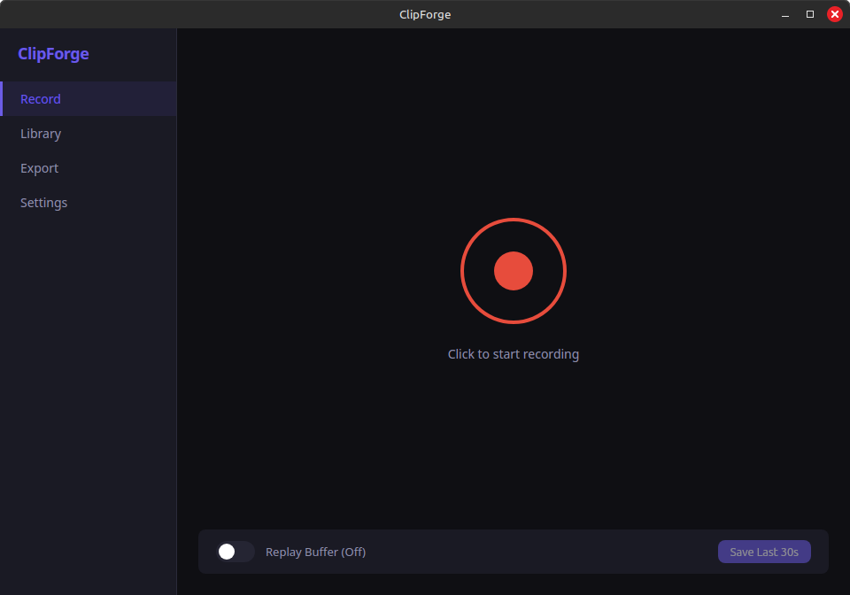

<p align="center">
  <h1 align="center">ClipForge</h1>
  <p align="center">
    Linux-first game recording with instant replay, hardware encoding, and a built-in library.
  </p>
</p>

<p align="center">
  <a href="https://github.com/alexanderwanyoike/clipforge/actions/workflows/ci.yml">
    
  </a>
  <a href="LICENSE">
    
  </a>
  
  
</p>

---

## Screenshot



## Overview

ClipForge is a lightweight, native game recording tool for Linux. It uses hardware-accelerated encoding (VA-API, NVENC, QSV) to capture gameplay with minimal performance impact and keeps a rolling replay buffer in shared memory so you can save the last 30 seconds at any time.

It ships as both a **desktop app** (Tauri + React) with tray controls and global hotkeys, and a **headless CLI** for streaming setups or remote machines.

## Features

- **Hardware-accelerated recording** -- X11 screen capture with VA-API, NVENC, or QSV encoding, falling back to software x264
- **Instant replay buffer** -- Ring-buffer segments in `/dev/shm` for zero-disk-overhead replay saves
- **Desktop audio capture** -- Automatically resolves the active PulseAudio/PipeWire monitor source
- **Recording library** -- FTS5-indexed SQLite database with auto-generated thumbnails and metadata
- **Export presets** -- YouTube, Shorts (9:16 crop), Trailer, and High Quality with loudnorm normalization
- **System tray & hotkeys** -- Start/stop recording and save replays without leaving your game
- **CLI interface** -- Record, replay, export, and diagnose from the terminal
- **System doctor** -- Built-in diagnostics for FFmpeg, GPU drivers, audio, and display server

## Requirements

| Dependency | Version | Notes |
|---|---|---|
| Linux | X11 or XWayland | Wayland-native capture is on the roadmap |
| FFmpeg | 5.0+ | With `x11grab` and `pulse` input support |
| PipeWire or PulseAudio | -- | PipeWire recommended |
| Rust | 1.75+ | For building from source |
| Node.js | 18+ | For the desktop UI |
| Yarn | 1.x | Package manager for the UI |

## Getting Started

### Install system dependencies

```bash
# Ubuntu / Debian
sudo apt install -y ffmpeg libwebkit2gtk-4.1-dev libsoup-3.0-dev \
  libjavascriptcoregtk-4.1-dev libglib2.0-dev libgtk-3-dev \
  libappindicator3-dev librsvg2-dev patchelf

# Fedora
sudo dnf install -y ffmpeg webkit2gtk4.1-devel libsoup3-devel \
  gtk3-devel libappindicator-gtk3-devel librsvg2-devel patchelf
```

### Build and run

```bash
git clone https://github.com/alexanderwanyoike/clipforge.git
cd clipforge

# Install UI dependencies
yarn --cwd ui install

# Development (hot-reload)
cargo tauri dev

# Production build
cargo tauri build
```

## CLI Usage

The standalone CLI binary works without the desktop UI:

```bash
# Record your screen (Ctrl+C to stop)
clipforge record --fps 60

# Start a 30-second replay buffer
clipforge replay --seconds 30

# Save the last 30 seconds from a running buffer
clipforge save-replay --seconds 30 --out highlight.mkv

# Export with a preset
clipforge export --input recording.mkv --preset youtube --out final.mp4

# List available encoders and audio devices
clipforge devices

# Run system diagnostics
clipforge doctor
```

## Project Structure

```
crates/
  clipforge-core/     Core library: capture, encoding, replay, library, export
  clipforge-cli/      Standalone CLI binary
src-tauri/            Tauri desktop app with commands and state management
ui/                   React + TypeScript frontend
```

## Configuration

Settings are stored in `~/.config/ClipForge/config.json` and created automatically on first run.

| Path | Default Location |
|---|---|
| Recordings | `~/Videos/ClipForge/recordings/` |
| Replays | `~/Videos/ClipForge/replays/` |
| Exports | `~/Videos/ClipForge/exports/` |
| Replay cache | `/dev/shm/clipforge-replay/` |
| Thumbnails | `~/.cache/clipforge/thumbnails/` |
| Database | `~/.local/share/clipforge/library.db` |

## Development

```bash
# Run all tests
cargo test --workspace

# Run core library tests only
cargo test -p clipforge-core

# Lint
cargo clippy --workspace -- -D warnings

# Format
cargo fmt --all
```

## License

[MIT](LICENSE)
